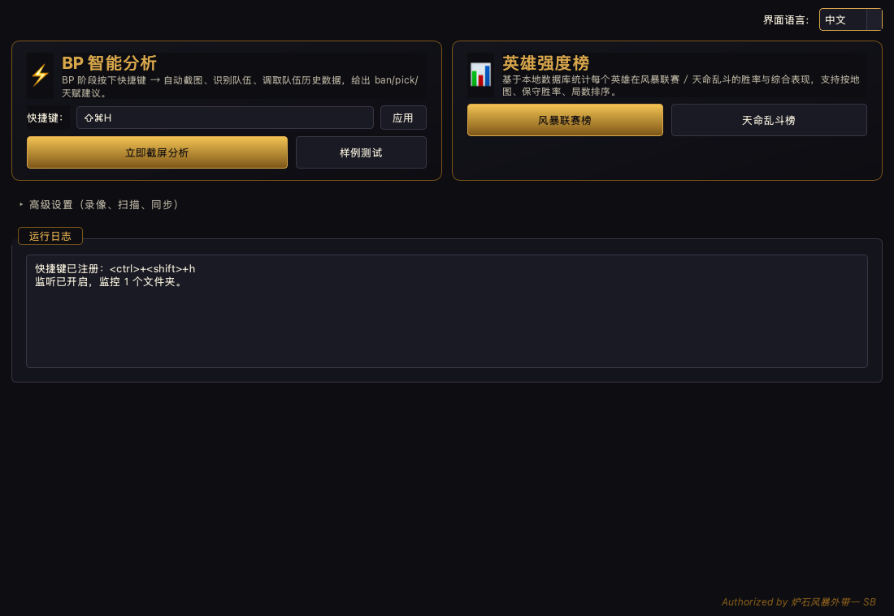
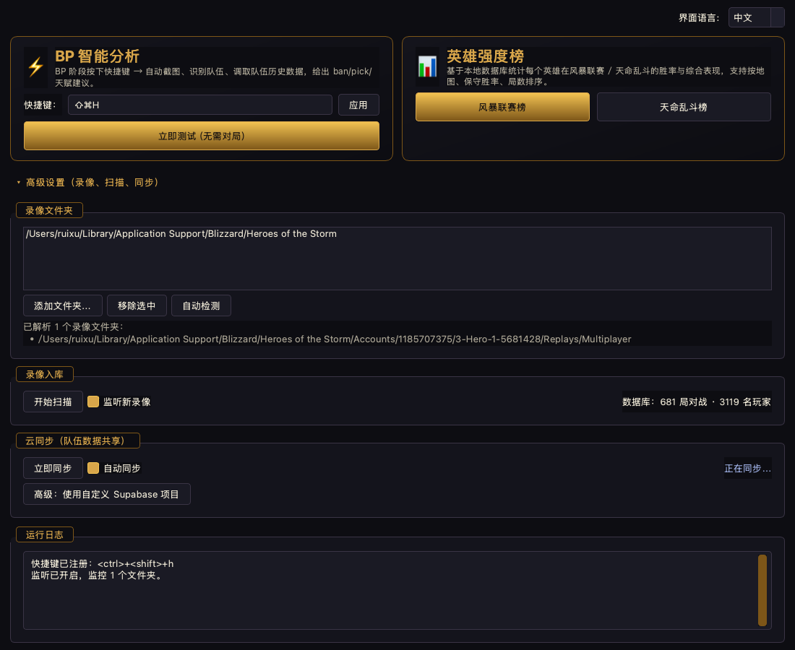
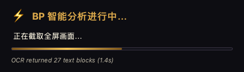
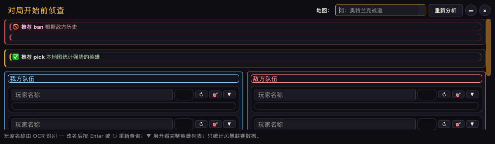
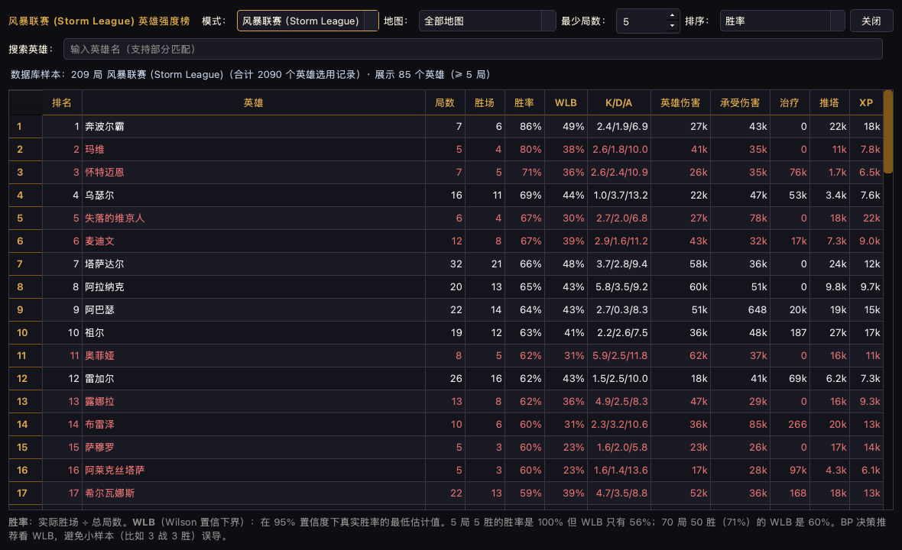
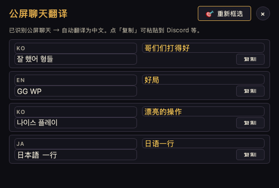
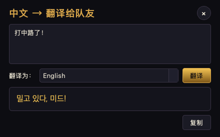

# HotS Helper

A locally-running Heroes of the Storm replay analyzer + pre-game BP scout
for Storm League squads. Designed for one squad to share their match
history across machines and get data-driven ban/pick suggestions in real
time during the draft.



## Features

- **BP intelligence (the headline feature).** Press a global hotkey
  during the draft → app captures the screen, OCRs both teams, joins
  against the squad's combined match history, and pops up a floating
  always-on-top window with:
  - 🚫 ban suggestions ranked by who on the enemy team plays each
    candidate well (statistically significant lift over the player's
    own baseline);
  - ✅ pick suggestions for the active map (Wilson 95% lower bound +
    z-test against global average);
  - per-player card with K/D/A, win-rate, and **per-map** vs.
    **all-maps** hero breakdown — the map-aware list at the top is
    sorted by win-rate so you can see which heroes the player wins
    with on this specific battleground.
- **Hero strength rankings** for both Storm League and ARAM, filterable
  by map and sortable by raw win-rate, conservative win-rate
  (Wilson lower bound, the recommended setting), games played, or
  alphabetical.
- **Cloud sync** — embedded Supabase backend with watermark-based
  incremental sync. Squad members run the same `.exe` and see each
  other's matches automatically. No setup needed; for private
  deployments there's an "Advanced" toggle to point at your own project.
- **Replay ingest** — watches your replay folder, parses each
  `.StormReplay` (talents, K/D/A, damage, healing, awards, bans,
  pre-draft attributes, …), de-duplicates by `match_key` so teammate
  copies of the same match don't inflate stats.
- **Talent names in 中文** — bundled lookup table of 2 700+ talent IDs
  → 官方简中名（数据来源：HeroesToolChest gamestrings 镜像）。
- **Sample mode** — bundled sample BP screenshot lets you see the
  popup without launching a real game.
- **In-game translation** — two extra hotkeys:
  - `Ctrl+Shift+T` 截图公屏聊天 → 自动翻译为中文（韩/日/英 → 中），
    每行带「复制」按钮粘贴到 Discord/笔记。
  - `Ctrl+Shift+Y` 弹出小输入框 → 中文 → 选择目标语言（en/ko/ja）→ 出译文复制粘贴到游戏聊天框。
  - 后端走 Supabase Edge Function 中转 VolcEngine 火山翻译；密钥不落地客户端。
    部署说明见 [`packaging/supabase/README.md`](packaging/supabase/README.md)。

## Screenshots

### Main window

The two primary features (BP intelligence + ranking) get hero cards on
top; everything else (replay folders, scan, cloud sync) collapses
behind the "高级设置" toggle.


Expanded settings panel:



### Capture progress

When the hotkey fires, a floating gold-bordered card streams the
pipeline status while OCR runs (1–3 s on Windows). Always-on-top,
focus-safe — won't kick a fullscreen game out of exclusive mode.



### BP popup

Two columns of player cards (allies / enemies), ban + pick suggestions
on top, map dropdown filter at top-right.



### Hero strength ranking

Sort by conservative win-rate by default; filter by map (SL ↔ ARAM
pools auto-switch when you change mode).



### In-game translation

`Ctrl+Shift+T` snaps the screen, OCRs the chat panel (bottom-center
region by default), and translates each line to Chinese. Click 复制 to
copy. If the heuristic missed something or grabbed a non-chat label,
hit 🎯 重新框选 and drag a tighter rectangle on the original
screenshot — the popup re-OCRs and re-translates that exact region.



`Ctrl+Shift+Y` opens a small composer for the reverse direction:
type Chinese, pick a target language (English / 한국어 / 日本語),
get the translation back ready to paste.



---

## Quick start (development)

```bash
# Install uv (https://docs.astral.sh/uv/)

# Clone, sync deps
uv sync

# Run the desktop app
uv run hots-ui

# Or use the CLI
uv run hots scan        # scan the configured/auto-detected replay folder
uv run hots stats       # DB summary
uv run hots bp 巨龙镇 -e Player1 -e Player2 -e Player3 -e Player4 -e Player5
uv run hots hero 阿兹莫丹 --map 巨龙镇
```

The first launch auto-detects the standard HotS replay folder and
offers it in the **录像文件夹 / Replay folders** section. Click
**开始扫描 / Start scan** once to ingest everything; tick **监听新录像
/ Watch for new replays** to keep it live.

If the squad cloud-sync defaults are present (they are in the shipped
`.exe`), a fresh install will also pull every match the squad has
already uploaded — no scan needed for new members.

---

## Windows

### Path 1 — run from source

```powershell
winget install --id=astral-sh.uv
uv sync
uv run hots-ui
```

**Install OCR language packs.** Windows Media OCR is single-language
per pass, so the app fans out across whichever languages are installed
and merges results. Add as many as you need:

- Settings → Time & Language → Language & region → Add a language
- Recommended for an Asian server: 中文（简体, 中国）, 日本語, 한국어
- For each language: click it → Language options → ensure "Basic typing"
  is installed (that includes the OCR data).

English-only works if all your matches are alphanumeric names.

### Path 2 — distribute the `.exe`

Build on Windows itself (the bootloader is platform-specific):

```powershell
uv sync
uv run pyinstaller packaging\hots-helper.spec --clean --noconfirm
```

`packaging\build-windows.ps1` is a thin wrapper.

Output: `dist\HotS-Helper\` — zip the **whole folder** (the `.exe` is
just a launcher; the real Python + Qt + ONNX code lives next to it
under `_internal\`). Users double-click the `.exe`; no Python install
required. Total size is ~150–180 MB.

The build bundles the VC++ runtime DLLs (`vcruntime140.dll`,
`msvcp140.dll`, `ucrtbase.dll`) so end users on a clean Windows install
don't have to install the Visual C++ Redistributable.

### Default replay folder

```
%USERPROFILE%\Documents\Heroes of the Storm\Accounts\<id>\<region>-Hero-…\Replays\Multiplayer\
```

OneDrive-redirected `Documents` (`%USERPROFILE%\OneDrive\Documents\…`
and the Chinese `OneDrive\文档\…`) are also probed. If your install
lives elsewhere, add it manually in **Replay folders**.

### Hotkey

Default: `Ctrl + Shift + H`. Uses `pynput` to listen globally — should
just work, no admin permission required unless your antivirus is
paranoid about input listeners. Change it in the BP card if there's
a collision.

### Anti-virus / SmartScreen

PyInstaller binaries sometimes trigger SmartScreen on first run because
they're not code-signed. Click "More info" → "Run anyway", or sign the
binary if you're distributing widely.

---

## macOS

`uv run hots-ui` works the same. The first time you press the hotkey,
macOS will ask for two permissions:

- **Accessibility** — so `pynput` can read global key events.
- **Screen Recording** — so `mss` can capture the full screen.

System Settings → Privacy & Security → enable both for Terminal (or
Python.app, whichever the prompt names). Restart the app afterwards.

OCR uses the built-in Vision framework (macOS 10.15+). No additional
setup.

---

## Data layout

| Path | Contents |
|---|---|
| `~/.config/hots-helper/config.json` (Linux) / `~/Library/Application Support/hots-helper/config.json` (mac) / `%APPDATA%\hots-helper\config.json` (Win) | folder list, hotkey, language, sync prefs |
| `~/Library/Application Support/hots-helper/hots.db` (mac) / `%LOCALAPPDATA%\hots-helper\hots.db` (Win) | local SQLite database |
| `~/Library/Application Support/hots-helper/screenshots/` | hotkey screenshots, prematch-`<ts>`.png |
| `~/Library/Application Support/hots-helper/sync_watermark.json` | last-pushed / last-pulled timestamps |

The DB used to live in the repo at `data/hots.db`; it's now in the
user-data dir on every platform. Cloud sync repopulates a fresh
install on first launch, so squad members joining later don't need to
copy anything by hand.

Delete the `.db` file to start fresh. Scanning is idempotent — re-runs
only add new replays; same-match perspectives from teammates are
de-duplicated by `match_key`.

---

## CLI

```bash
hots scan [folder]                # one-shot ingest (idempotent)
hots watch [folder]               # bootstrap scan + live watcher
hots stats                        # DB summary
hots players                      # everybody seen in replays
hots lookup <name> [--map]        # full per-player breakdown
hots hero <hero> [--map]          # hero deep-dive: maps + talents
hots heroes --min N               # all heroes with ≥ N games
hots map <map> --min N            # heroes statistically strong/weak on a map
hots bp <map> -e p1 ... -e p5     # full BP advisor (bans + picks)
```

All commands accept `--db <path>` to override the database location.

---

## Maintenance scripts

```bash
# Refresh the bundled talent-name lookup (run after a HotS patch).
python scripts/fetch_talent_names.py

# Re-render the multi-res app icon set from icon.svg.
python scripts/build_icons.py
```

---

Authorized by 炉石风暴外带一 SB
